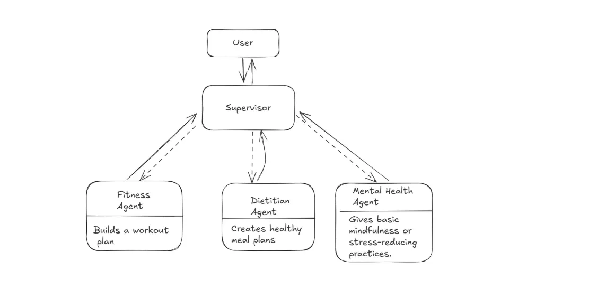
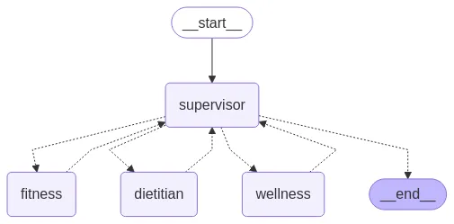
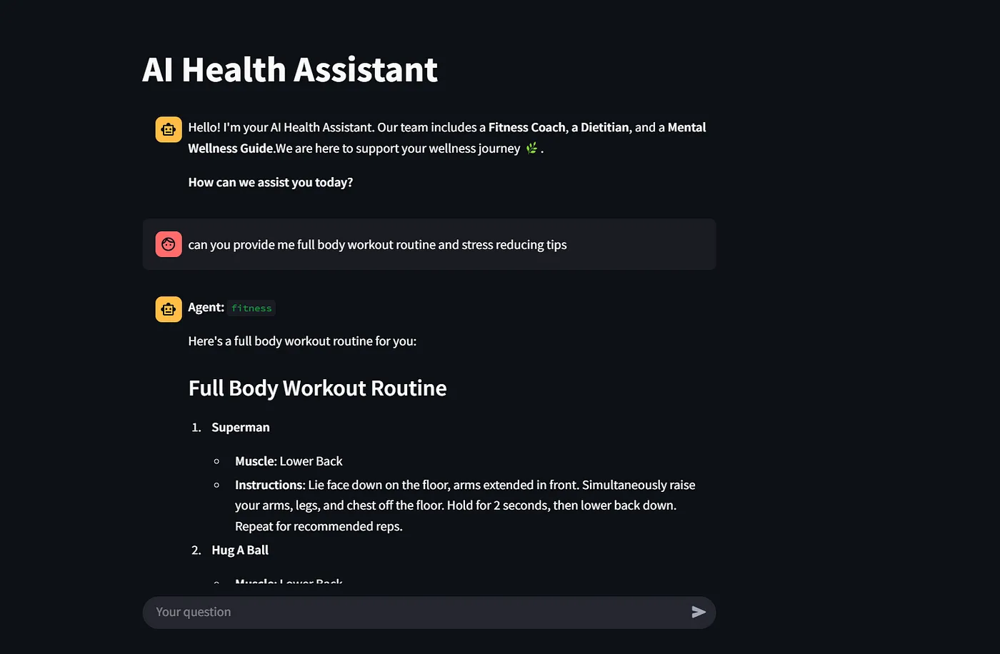
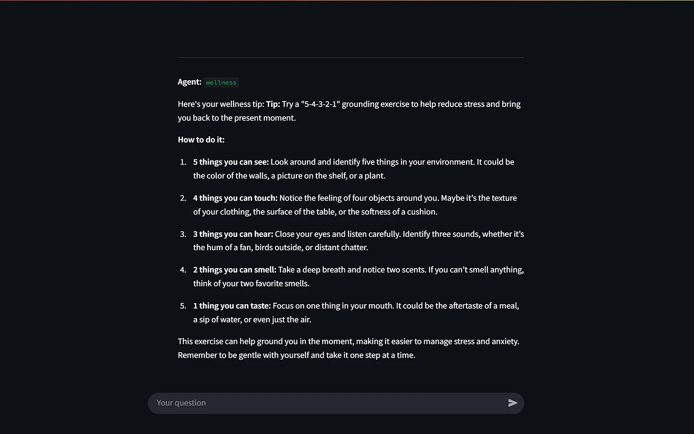

[Reference](https://levelup.gitconnected.com/how-to-build-a-multi-agent-supervisor-system-with-langgraph-qwen-streamlit-2aabed617468)
[Github link](https://github.com/Mercytopsy/AI-Health-Supervisor-Agent)

# Multi-Agent Supervisor System with LangGraph, Qwen, and Streamlit
This project demonstrates how to build a multi-agent supervisor system using LangGraph, Qwen, and Streamlit. The system is designed to manage multiple agents that can perform tasks based on user input.

# The Supervisor Architecture


# Step 1: Installation
Before we can use Qwen locally, we need to install Ollama, which allows us to run large language models directly on our machine.

i)Download and Install Ollama

To download Ollama, go to their [official website](https://ollama.com/download/linux) and download the version compatible with your operating system.

ii) Verify Installation

```bash
ollama -v
```

ii) Pull the Qwen Model

```bash
ollama pull qwen2.5:14b
```

# Step 2: Set Up API Keys
Our system will rely on external APIs to provide real-world data for the Fitness Agent and the Dietitian Agent. These agents will fetch exercise and nutrition information from these respective APIs.

## APIs Used:

- Fitness Agent : [API-Ninjas Exercise API](https://api-ninjas.com/api/exercises)
- Dietitian Agent : [Spoonacular Food & Nutrition API](https://spoonacular.com/food-api/console#Profile)

i) Get Your API Keys

Sign up for free accounts on both platforms and retrieve your API keys.

ii) Store Keys

To keep our credentials secure and easily accessible, we’ll store them in a .env file.

The .env file will look like this;

```
EXERCISE_API_KEY=xxxxxxxx 
DIET_API_KEY=xxxxxxxxxxxx
```

# Step 3: Create State
In building our AI Health Assistant, one of the first things we need to set up is the state. The state plays a crucial role in helping our agents keep track of conversation history as they interact and pass tasks between each other throughout the workflow.


# Step 4: Create Custom Tools
Earlier, we obtained API keys from API-Ninjas (for exercise data) and Spoonacular (for food and nutrition data). Now it’s time to put those to use by creating custom tools for our agents. These tools are what the agent will call on to carry out their tasks.


# Step 5: Define LLM
Here, we’ll define our large language model, which is the Qwen2.5:14b model. This model is well-suited for building intelligent agents.


# Step 6: Creating the Agent & Nodes
In this step, we will create our nodes and agents, where we make use of the prebuilt `create_react_agent` in LangGraph.


# Step 7: Build Multi-Agent Graph
Now, we build the workflow graph, where we add the supervisor node as the starting point of the execution. After that, we add the remaining agent nodes.




# Step 8: Test the Multi-Agent System
At this stage, our multi-agent system is fully set up and ready to receive user input. Before sending the input, let’s first define a helper function to extract the agents’ output

Here’s what the result looks like in the Streamlit app.

